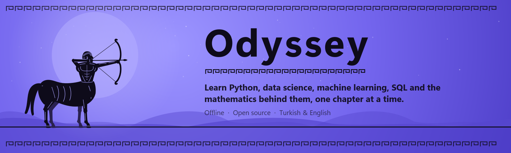
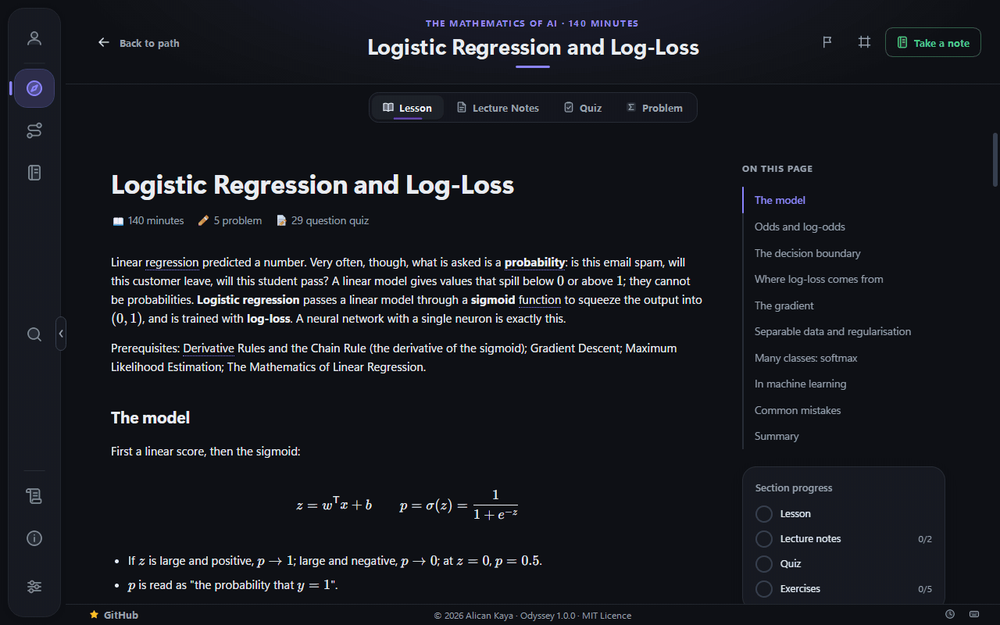
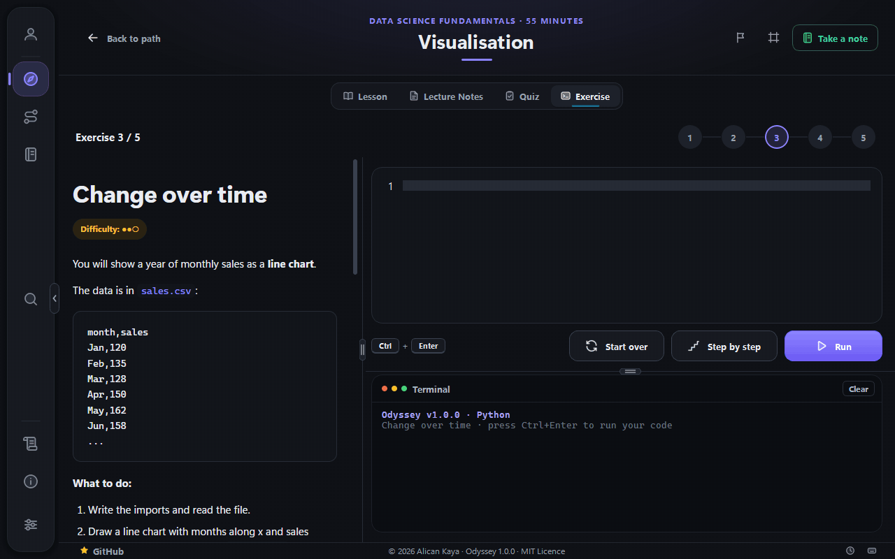
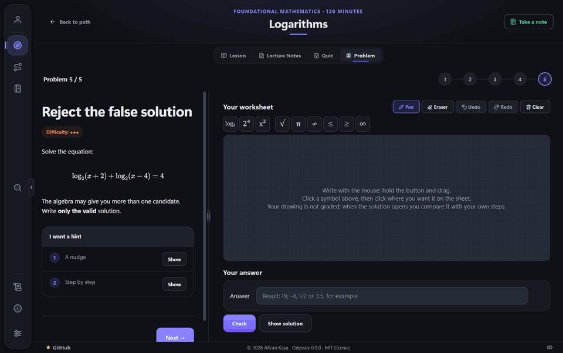
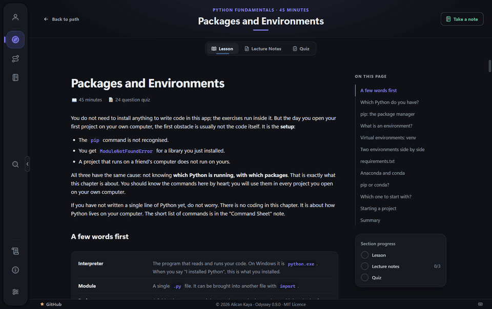
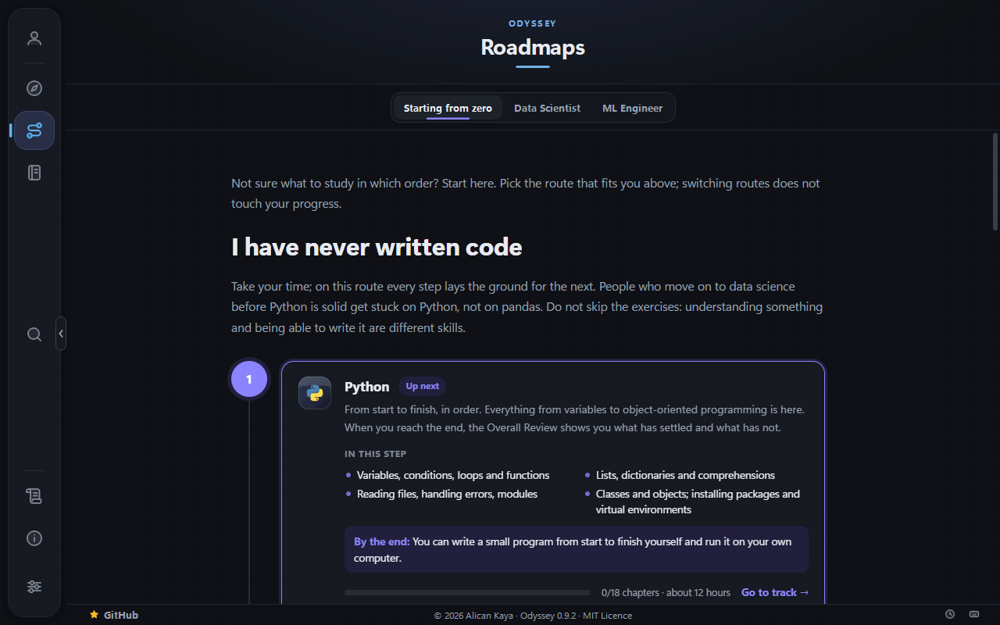
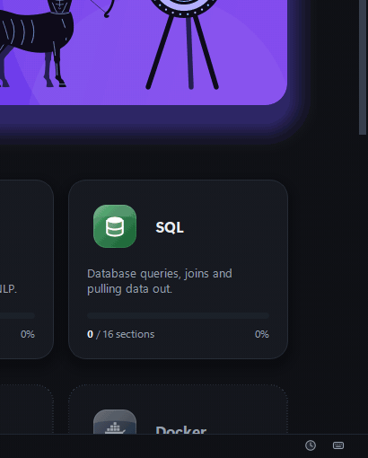
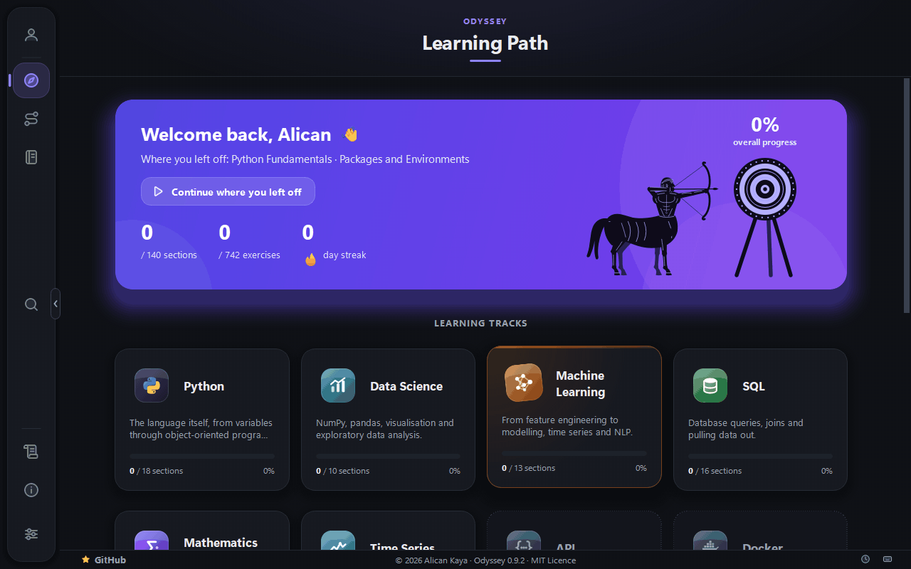
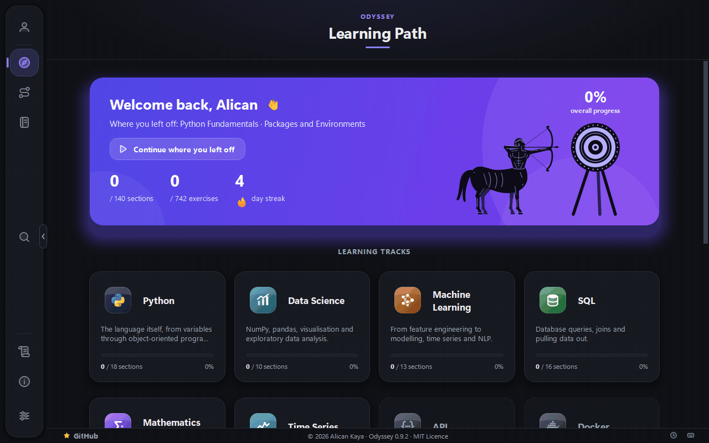

<div align="right">
  <a href="./README.tr.md">Türkçe</a> · <b>English</b>
</div>

<p align="center">
  
</p>

<p align="center">
  <a href="https://github.com/AlicanKaya192/Odyssey/releases"></a>
  
  
  
  <br>
  <a href="LICENSE"></a>
  
  
  <a href="https://github.com/AlicanKaya192/Odyssey/stargazers"></a>
</p>

An offline desktop application that teaches Python, data science, machine learning, SQL and the mathematics behind them, one section at a time.

Every section has a lesson, lecture notes, a quiz and coding exercises; mathematics sections have problems instead, worked on a drawing sheet. To complete a section you need to pass the quiz and solve the exercises. You write the code inside the application; it runs your code, then checks the output, the variables it created and the functions it defined. No artificial intelligence is involved — every check is defined in advance and evaluated deterministically, so the same code always produces the same result.

## A look inside

**Opening.** While the application loads, Odyssey's mascot — a centaur in the style of Greek black-figure vases — gallops in, looses an arrow and hits the target dead centre. It takes about three seconds; press `Esc` or click to skip it.

<p align="center">
  
</p>

**Lessons** come with formulas, figures and an outline of the page, and remember how far you have read.

<p align="center">
  
</p>

**Exercises** run your code inside the application. The terminal below the editor shows the result; if the code draws a chart, it opens on the left.

<p align="center">
  
</p>

**Mathematics problems** are worked out by hand on a drawing sheet. Only the answer is checked; once you solve it, or after two wrong tries, the solution paths open on the left so you can compare them with your own steps.

<p align="center">
  
</p>

**Notes** are taken beside the lesson: quote a sentence from the page, add your own words, and everything is saved as you type. **My Notes** gathers them by path and in your own folders; the global search (`Ctrl+K`) finds them too, and you can download and upload them.

<p align="center">
  
</p>

**Roadmaps** suggest an order for your goal — starting from zero, moving into data science, or becoming an ML engineer. Each step says what it covers, what you will be able to do by the end and roughly how long it takes; the chapters to focus on open with a click.

<p align="center">
  
</p>

**Finishing a section or earning a badge** is celebrated with a card in the bottom right corner.

<p align="center">
  
</p>

**Updates** download in their own window while you keep studying: size, speed and time left are shown as the centaur runs, and when it is done it shoots its arrow and the new version installs.

<p align="center">
  
</p>

**Closing** asks before it quits, says your progress is saved and whether your streak is safe today.

<p align="center">
  
</p>

## Getting started

**1. Download the installer.** Take the `Odyssey-<version>-setup.exe` file from the [Releases](https://github.com/AlicanKaya192/Odyssey/releases) page. Windows 10 or 11, 64-bit. No administrator rights are needed.

**2. Run it.** Odyssey installs for your own user account, under `%LOCALAPPDATA%\Programs\Odyssey`, and puts a shortcut in the Start menu and — unless you untick the box — on your desktop. From then on you open it from the shortcut.

**3. Windows may warn you the first time.** A blue box appears saying "Windows protected your PC". This is SmartScreen, and it appears because the installer is not code-signed — Windows cannot tell who published it, so it warns about everything it has not seen before. Click **More info**, then **Run anyway**.

**Coming from an unpacked folder?** Versions up to 0.8.2.1 were a zip you extracted yourself. Do not install over them by hand — update from inside the application instead: it installs the new version, removes the program files from the old folder and keeps your progress. A version older than 0.8.2.1 first offers 0.8.2.1, then the installer.

### Your progress is kept outside the application

Everything you do — your progress, quiz scores, the code you write, your notes, your profile and the photo you choose — is stored in `%APPDATA%\Odyssey\`, not in the application folder.

That separation is the point: installing a new version, uninstalling or reinstalling never touches your progress. When you update, you carry on where you left off.

### Updating

Odyssey checks for a new version when it starts, and every three hours if you leave it open. When there is one, it tells you and offers to install it.

Press **Update** and the application downloads the new installer, checks that it arrived intact and closes; the installation then finishes on its own and Odyssey opens again. Your progress is untouched.

If the update cannot be started — the disk is full, for example — the application says so and gives you the release page. Doing it by hand is always the same thing: download the new installer and run it.

You can turn the check off under **Settings › Updates**. With it off, the application never touches the network at all.

### Uninstalling

**Settings › Apps › Installed apps › Odyssey › Uninstall** removes the application. Your progress in `%APPDATA%\Odyssey\` stays, so a later installation picks up where you left off; delete that folder as well if you want to remove everything.

## Status

Early development (`0.9.0`), released as an open beta. The application works end to end. The engine — learning paths, lessons, quizzes, the exercise runner, progress tracking, updates — is in place; the curriculum is still growing.

**Content today:** five paths are **complete** — Python Fundamentals (eighteen sections, starting with packages and environments), Data Science (ten), Machine Learning (thirteen), SQL (sixteen, from installing SQL Server to window functions, indexes, views and stored procedures) and Mathematics, in two modules: Foundational Mathematics (twenty-eight sections, from numbers to probability and statistics) and The Mathematics of AI (thirty-two, linear algebra, calculus, probability and statistics). 3398 quiz questions, 267 coding exercises, 300 mathematics problems and 239 lecture notes, all of it in both Turkish and English.

**Thirteen learning paths** are defined: Python, Data Science, Machine Learning, SQL and Mathematics are open, while API, Docker, Time Series, Natural Language Processing and the others are visible but locked until their content is written.

**Working:** an animated start-up with the centaur mascot, learning paths, lessons with a section outline and reading progress, lecture notes, timed quizzes, coding exercises in Python and SQL with automatic checking (SQL runs on your own SQL Server and every run is rolled back), graded hints, error explanations, mathematics problems on a drawing sheet with step-by-step solution paths, suggested study routes, streak reminders as Windows notifications, sections that unlock in order, persistent progress, your own notes with a global search (`Ctrl+K`), 29 badges celebrated with a card as you earn them, an activity calendar, a profile with your own photo, Turkish/English interface and content, light and dark themes, in-app updates, and options to remove the section lock and the quiz time limit.

**Not there yet:** the content for the other paths, and a larger exercise engine for projects that run a dataset end to end.

The roadmap moves along in [CHANGELOG.en.md](CHANGELOG.en.md).

## Running from source

- Windows 10 / 11
- Python 3.10 – 3.14 (a clean CPython installation)

Do not use Anaconda's Python. Anaconda ships its own MSVC runtime libraries, and when Qt's DLLs load those, the application will not start.

```bash
py -3.14 tools/setup_env.py
```

This command creates both the environment the application runs in and the separate environment the exercises run in. Then:

```bash
.venv\Scripts\python app\main.py
```

## Languages

Both the interface and the content are available in Turkish and English. You can switch at any time from Settings, without restarting. On a Turkish computer the application starts in Turkish and on any other in English, until you choose for yourself. If a section has not been translated into English yet, the Turkish version is shown with a notice at the top.

## How are exercises checked?

Your code runs in a separate process, inside an isolated working folder. Its output, the variables it creates and the functions it defines are then compared against expected values. Every check is predefined; no external service takes part in evaluating your code.

**Note:** this is not a security sandbox. You are running your own code on your own machine. What the system provides is an isolated working folder, a timeout, an output limit, and the guarantee that the application does not crash when your code raises an error.

## Internet

Everything about learning works offline: the lessons, the lecture notes, the quizzes, the exercises and your progress. None of it involves a server, and your progress never leaves your computer.

The application goes online only if you leave the update check on: for the version check described above and, alongside it, to read the number of stars Odyssey has on GitHub, shown in the bottom strip. Neither request sends anything — no identity, no progress, no usage data — and a file is downloaded only when you press Update. With the check turned off, the application never touches the network.

Addresses in the "My Links" and "Extra Content" tabs do not open inside the application; clicking one hands it to your system browser.

## Contributing

Issues and pull requests are welcome. Please read [CONTRIBUTING.md](CONTRIBUTING.md) and the [Code of Conduct](CODE_OF_CONDUCT.md) first. Security reports have their own route: see [SECURITY.md](SECURITY.md).

## Licence

MIT Licence — Copyright (c) 2026 Alican Kaya. See [LICENSE](LICENSE) for details.

The course content comes from the [Data Science Roadmap](https://github.com/AlicanKaya192/Data-Science-RoadMap) project and falls under the same licence.
