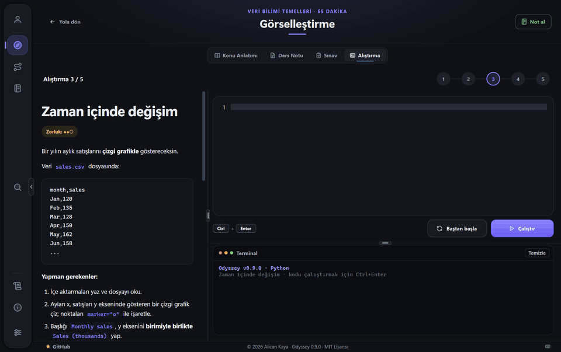
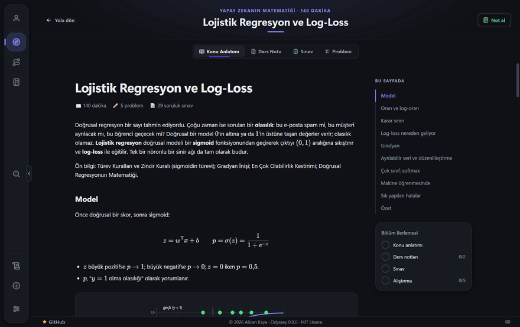
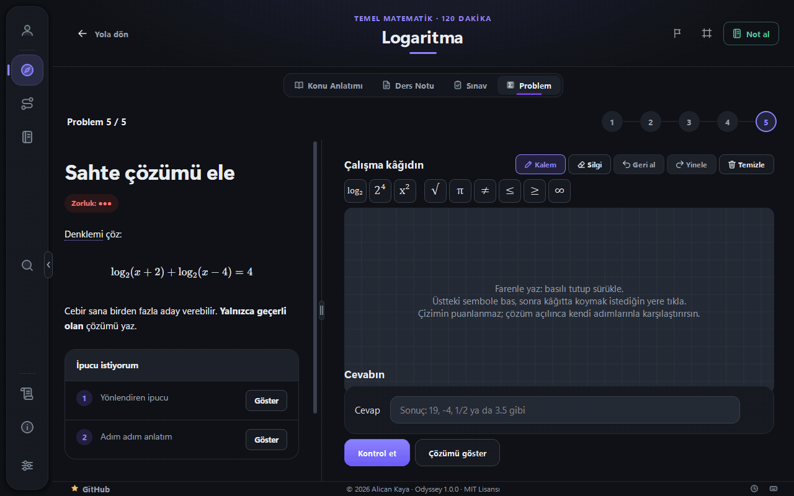
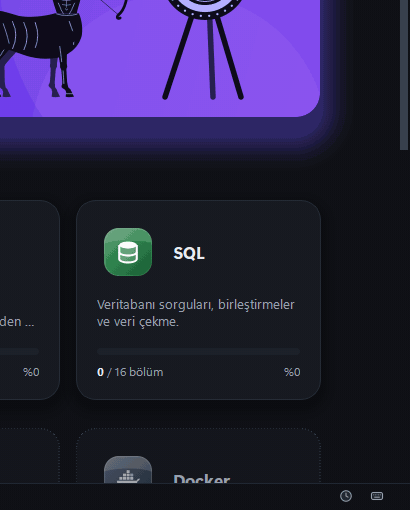

<div align="right">
  <b>Türkçe</b> · <a href="./README.md">English</a>
</div>

# Odyssey

Python, veri bilimi, makine öğrenmesi, SQL ve bunların arkasındaki matematiği bölüm bölüm öğreten, çevrimdışı çalışan bir masaüstü uygulaması.

<p align="center">
  
</p>

Her bölümde konu anlatımı, ders notları, sınav ve kod alıştırmaları var; matematik bölümlerinde alıştırma yerine çizim kâğıdında çözülen problemler var. Bir bölümü tamamlamak için sınavı geçmek ve alıştırmaları çözmek gerekiyor. Kod uygulamanın içinde yazılıyor; program onu çalıştırıyor, ardından çıktısını, oluşturduğu değişkenleri ve tanımladığı fonksiyonları kontrol ediyor. Yapay zeka kullanılmıyor — her kontrol önceden tanımlıdır ve deterministik olarak değerlendirilir, yani aynı kod her zaman aynı sonucu verir.

## İçeriden bir bakış

**Konu anlatımları** formüller, şekiller ve sayfanın başlık listesiyle geliyor; nereye kadar okuduğunuzu hatırlıyor.

<p align="center">
  
</p>

**Matematik problemleri** çizim kâğıdında elle çözülüyor. Yalnızca cevap denetleniyor; çözünce ya da iki yanlıştan sonra çözüm yolları solda açılıyor, kendi adımlarınızla karşılaştırabiliyorsunuz.

<p align="center">
  
</p>

**Bir bölümü bitirmek ya da rozet kazanmak** sağ alt köşede bir kartla kutlanıyor.

<p align="center">
  
</p>

## Başlarken

**1. Kurulum dosyasını indirin.** [Releases](https://github.com/AlicanKaya192/Odyssey/releases) sayfasından `Odyssey-<sürüm>-setup.exe` dosyasını alın. Windows 10 veya 11, 64-bit. Yönetici yetkisi gerekmiyor.

**2. Çalıştırın.** Odyssey kendi kullanıcı hesabınıza, `%LOCALAPPDATA%\Programs\Odyssey` altına kuruluyor; Başlat menüsüne ve — kutuyu kaldırmazsanız — masaüstüne kısayol koyuyor. Bundan sonra kısayoldan açıyorsunuz.

**3. Windows ilk seferde uyarı verebilir.** "Windows kişisel bilgisayarınızı korudu" yazan mavi bir kutu çıkıyor. Bu SmartScreen ve sebebi kurulum dosyasının **imzalı olmaması**: Windows yayıncının kim olduğunu göremiyor, o yüzden daha önce görmediği her programa aynı uyarıyı veriyor. **Ek bilgi**'ye, ardından **Yine de çalıştır**'a tıklayın.

**Çıkardığınız bir klasörden mi geliyorsunuz?** 0.8.2.1'e kadarki sürümler sizin çıkardığınız bir zip'ti. Üstüne elle kurmayın, uygulamanın içinden güncelleyin: yeni sürümü kuruyor, eski klasördeki program dosyalarını kaldırıyor ve ilerlemenizi koruyor. 0.8.2.1'den eski bir sürüm önce 0.8.2.1'i, ardından kurulumu öneriyor.

### İlerlemeniz uygulamanın dışında duruyor

Yaptığınız her şey — ilerlemeniz, sınav notlarınız, yazdığınız kodlar, notlarınız, profiliniz ve seçtiğiniz fotoğraf — uygulama klasöründe değil, `%APPDATA%\Odyssey\` içinde saklanıyor.

Bu ayrım bilinçli: yeni sürüm kurmak, kaldırmak ya da yeniden kurmak ilerlemenize dokunmuyor. Güncellediğinizde kaldığınız yerden devam ediyorsunuz.

### Güncelleme

Odyssey her açılışta yeni bir sürüm çıkıp çıkmadığına bakıyor; açık bırakırsanız üç saatte bir yeniden bakıyor. Yeni sürüm varsa haber veriyor ve kurmayı öneriyor.

**Güncelle**'ye bastığınızda uygulama yeni kurulum dosyasını indiriyor, sağlam geldiğini denetliyor ve kapanıyor; kurulum kendiliğinden tamamlanıyor ve Odyssey yeniden açılıyor. İlerlemenize dokunulmuyor.

Güncelleme başlatılamıyorsa — örneğin diskte yer yoksa — uygulama sebebini söylüyor ve sürüm sayfasını veriyor. Elle yapmak her zaman aynı şey: yeni kurulum dosyasını indirip çalıştırmak.

Denetimi **Ayarlar › Güncelleme** bölümünden kapatabilirsiniz. Kapalıyken uygulama ağa hiç çıkmıyor.

### Kaldırma

**Ayarlar › Uygulamalar › Yüklü uygulamalar › Odyssey › Kaldır** uygulamayı kaldırıyor. `%APPDATA%\Odyssey\` içindeki ilerlemeniz yerinde kalıyor, sonradan kurarsanız kaldığınız yerden devam ediyorsunuz; her şeyi silmek istiyorsanız o klasörü de silin.

## Durum

Erken geliştirme aşaması (`0.9.0`), açık beta olarak yayınlandı. Uygulama uçtan uca çalışıyor. Motor — öğrenme yolları, konu anlatımı, sınavlar, alıştırma çalıştırıcısı, ilerleme kaydı, güncelleme — yerinde; müfredat büyümeye devam ediyor.

**Bugünkü içerik:** beş patika **tamamlandı** — Python Temelleri (on yedi bölüm), Veri Bilimi (on), Makine Öğrenmesi (on üç), SQL (on altı; SQL Server'ı kurmaktan pencere fonksiyonlarına, dizinlere, görünümlere ve saklı yordamlara) ve iki modüllü Matematik: Temel Matematik (yirmi sekiz bölüm, sayılardan olasılık ve istatistiğe) ve Yapay Zekanın Matematiği (otuz iki; doğrusal cebir, kalkülüs, olasılık ve istatistik). 3374 sınav sorusu, 267 kod alıştırması, 300 matematik problemi ve 236 ders notu; tamamı Türkçe ve İngilizce.

**On üç öğrenme patikası** tanımlı: Python, Veri Bilimi, Makine Öğrenmesi, SQL ve Matematik açık; API, Docker, Zaman Serileri, Doğal Dil İşleme ve diğerleri içerikleri hazırlanana kadar kilitli görünüyor.

**Çalışanlar:** öğrenme patikaları, bölüm içi başlık listesi ve okuma takibiyle konu anlatımı, ders notları, süreli sınavlar, Python ve SQL için otomatik kontrollü kod alıştırmaları (SQL kendi SQL Server'ınızda çalışıyor, her deneme geri alınıyor), kademeli ipuçları, hata açıklamaları, çizim kâğıdında çözülen ve adım adım çözüm yolları olan matematik problemleri, önerilen çalışma rotaları, Windows bildirimi olarak gelen seri hatırlatmaları, sırayla açılan bölümler, kalıcı ilerleme kaydı, kendi notlarınız ve genel arama (`Ctrl+K`), kazanınca bir kartla kutlanan 29 rozet, etkinlik takvimi, kendi fotoğrafınızı seçebildiğiniz profil, Türkçe/İngilizce arayüz ve içerik, açık/koyu tema, uygulama içinden güncelleme, kilidi ve sınav süresini kaldırma seçenekleri.

**Henüz yok:** diğer patikaların içeriği ve bir veri setini baştan sona işleyen proje tipi alıştırmalar için daha geniş bir alıştırma motoru.

Yol haritası [CHANGELOG.md](CHANGELOG.md) dosyasında ilerliyor.

## Kaynak koddan çalıştırma

- Windows 10 / 11
- Python 3.10 – 3.14 (temiz bir CPython kurulumu)

Anaconda'nın Python'unu kullanmayın. Anaconda kendi MSVC çalışma zamanı kütüphanelerini taşıyor; Qt'nin DLL'leri onları yüklediğinde uygulama açılmıyor.

```bash
py -3.14 tools/setup_env.py
```

Bu komut hem uygulamanın çalıştığı ortamı hem de alıştırmaların çalıştığı ayrı ortamı kuruyor. Ardından:

```bash
.venv\Scripts\python app\main.py
```

## Diller

Arayüz ve içerik Türkçe ve İngilizce. Ayarlardan istediğiniz an değiştirebilirsiniz, uygulamayı yeniden başlatmaya gerek yok. Kendiniz seçene kadar uygulama, Türkçe bir bilgisayarda Türkçe, diğerlerinde İngilizce açılıyor. Bir bölümün İngilizce çevirisi henüz yoksa Türkçesi gösterilir ve üstte bunu belirten bir uyarı çıkar.

## Alıştırmalar nasıl kontrol ediliyor?

Kodunuz ayrı bir işlemde, izole bir çalışma klasöründe çalıştırılır. Ardından çıktısı, oluşturduğu değişkenler ve tanımladığı fonksiyonlar beklenen değerlerle karşılaştırılır. Kontrollerin tamamı önceden tanımlıdır; kod değerlendirmesinde herhangi bir dış servis kullanılmaz.

**Not:** Bu bir güvenlik sandbox'ı değildir. Kendi yazdığınız kodu kendi bilgisayarınızda çalıştırıyorsunuz. Sistemin sağladığı şey izole bir çalışma klasörü, zaman aşımı sınırı, çıktı sınırı ve kodun hata vermesi durumunda uygulamanın çökmemesidir.

## İnternet

Öğrenmeyle ilgili her şey çevrimdışı çalışır: dersler, ders notları, sınavlar, alıştırmalar ve ilerlemeniz. Hiçbiri bir sunucuya uğramaz; ilerlemeniz bilgisayarınızdan çıkmaz.

Uygulama yalnızca güncelleme denetimini açık bırakırsanız ağa çıkar: yukarıda anlatılan sürüm denetimi için ve onunla birlikte, alt şeritte görünen, Odyssey'in GitHub'daki yıldız sayısını okumak için. İki istekte de hiçbir bilgi gönderilmez — kimlik, ilerleme, kullanım verisi yok — ve dosya yalnızca siz Güncelle'ye bastığınızda iniyor. Denetim kapalıyken uygulama ağa hiç çıkmaz.

"Bağlantılarım" ve "Ekstra İçerikler" sekmelerindeki adresler uygulamanın içinde açılmaz; tıklandığında sistemin tarayıcısına devredilir.

## Katkıda bulunma

Sorun bildirimleri ve pull request'ler açığa açık. Önce [CONTRIBUTING.md](CONTRIBUTING.md) ve [Davranış Kuralları](CODE_OF_CONDUCT.md) dosyalarını okuyun. Güvenlik bildirimlerinin ayrı bir yolu var: [SECURITY.md](SECURITY.md).

## Lisans

MIT Lisansı — Telif hakkı (c) 2026 Alican Kaya. Ayrıntılar için [LICENSE](LICENSE) dosyasına bakın.

Ders içeriği [Data Science Roadmap](https://github.com/AlicanKaya192/Data-Science-RoadMap) projesinden geliyor ve aynı lisansa tabi.
