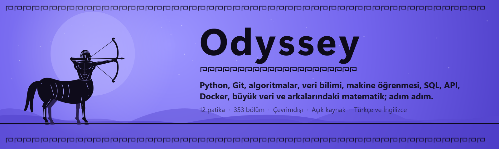
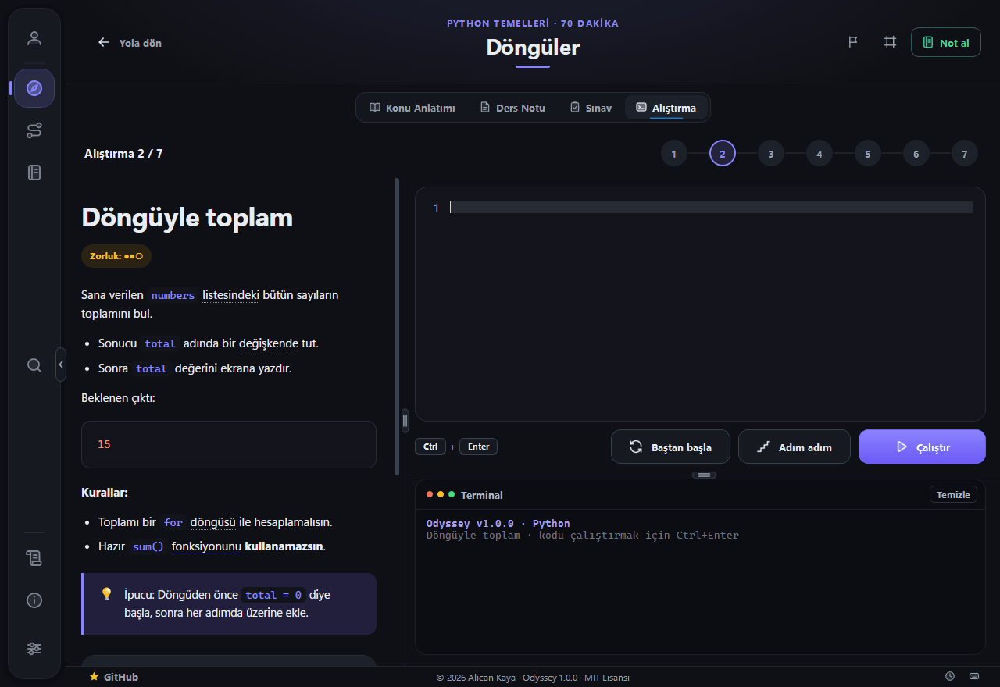
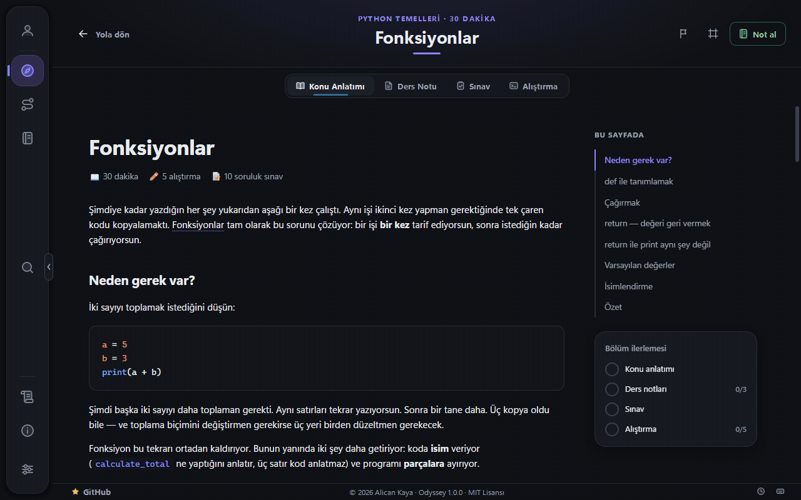
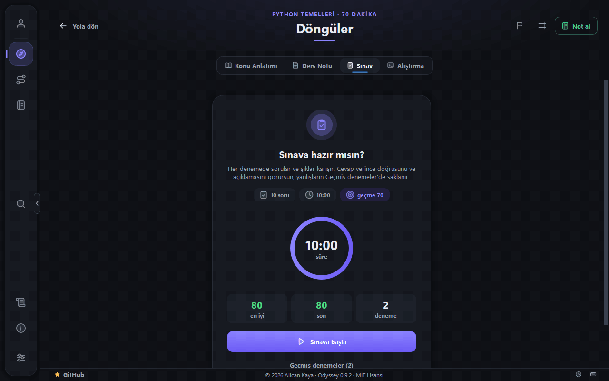
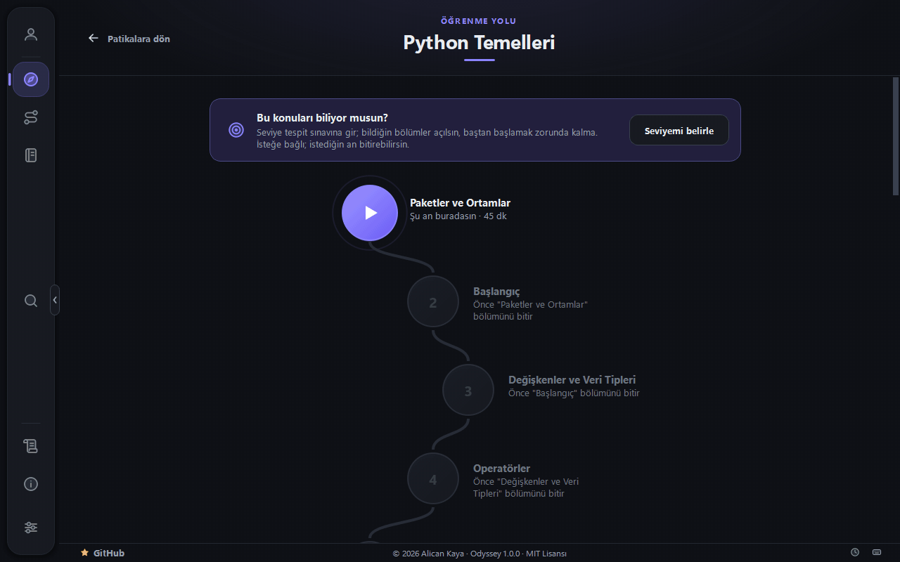
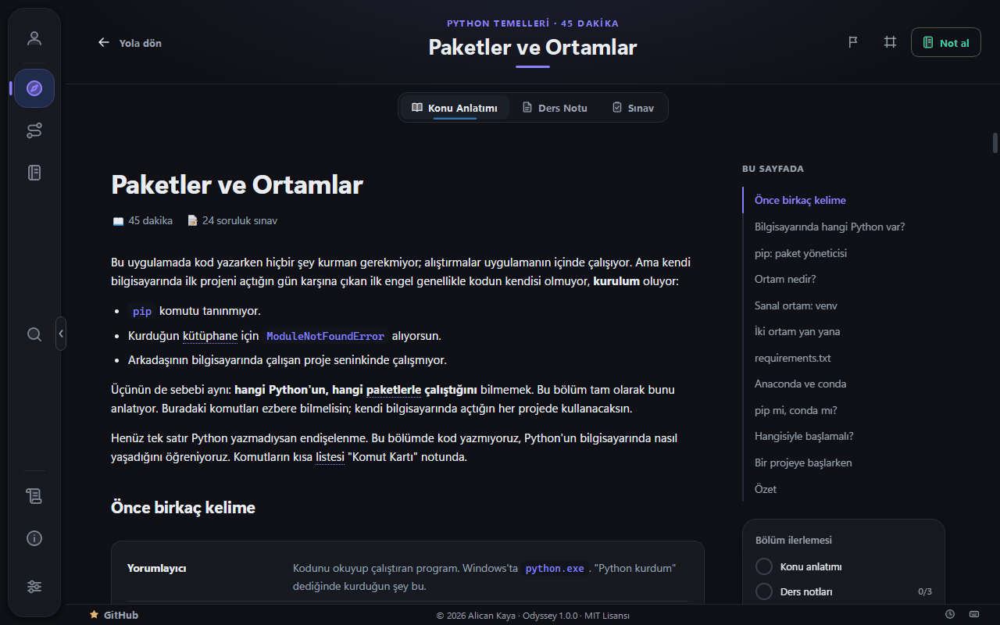
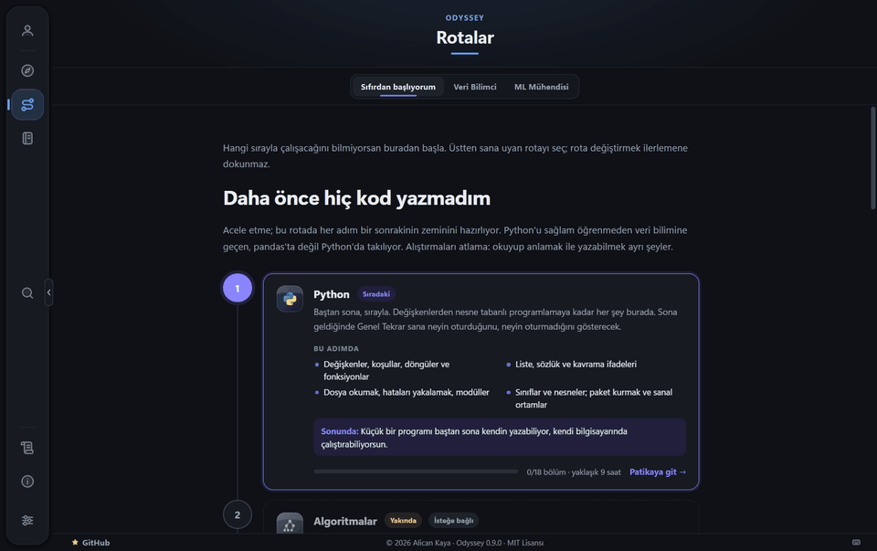
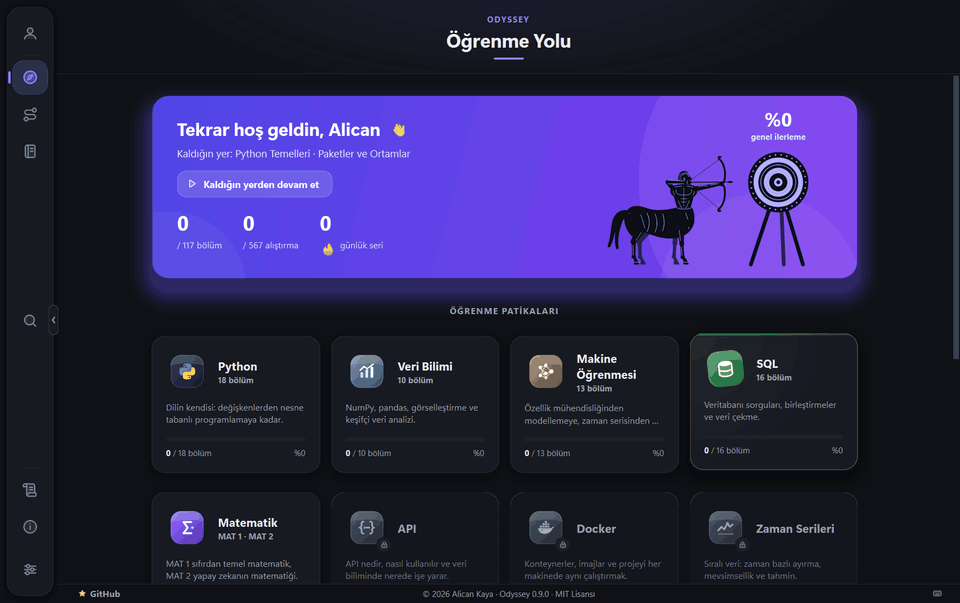
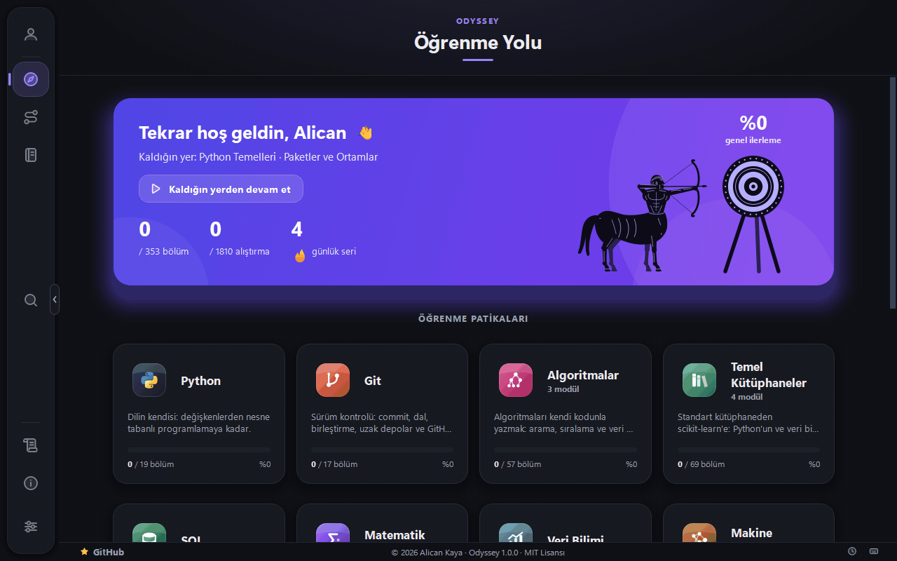

<div align="right">
  <b>Türkçe</b> · <a href="./README.md">English</a>
</div>

<p align="center">
  
</p>

<p align="center">
  <a href="https://github.com/AlicanKaya192/Odyssey/releases"></a>
  
  
  
  <br>
  <a href="LICENSE"></a>
  
  
  <a href="https://github.com/AlicanKaya192/Odyssey/stargazers"></a>
</p>

Python, Git, algoritmalar, Python ekosisteminin temel kütüphaneleri, veri bilimi, makine öğrenmesi, SQL, zaman serileri, API, Docker, büyük veri ve bunların arkasındaki matematiği bölüm bölüm öğreten, çevrimdışı çalışan bir masaüstü uygulaması.

Her bölümde konu anlatımı, ders notları, sınav ve kod alıştırmaları var; matematik bölümlerinde alıştırma yerine çizim kâğıdında çözülen problemler var. Bir bölümü tamamlamak için sınavı geçmek ve alıştırmaları çözmek gerekiyor. Kod uygulamanın içinde yazılıyor; program onu çalıştırıyor, ardından çıktısını, oluşturduğu değişkenleri ve tanımladığı fonksiyonları kontrol ediyor. Yapay zeka kullanılmıyor — her kontrol önceden tanımlıdır ve deterministik olarak değerlendirilir, yani aynı kod her zaman aynı sonucu verir.

## İçeriden bir bakış

**Açılış.** Uygulama yüklenirken Odyssey'in maskotu — antik Yunan vazolarındaki siyah figür üslubunda bir sentor — dörtnala gelip okunu atıyor ve ok hedefi tam ortadan vuruyor. Yaklaşık üç saniye sürüyor; `Esc`'ye basarak ya da tıklayarak geçebilirsiniz.

<p align="center">
  
</p>

**Konu anlatımları** formüller, şekiller ve sayfanın başlık listesiyle geliyor; nereye kadar okuduğunuzu hatırlıyor.

<p align="center">
  
</p>

**Alıştırmalar** kodunuzu uygulamanın içinde çalıştırıyor. Sonuç editörün altındaki terminalde görünüyor; kod bir grafik çizdiyse solda açılıyor.

<p align="center">
  
</p>

**Git, API ve Docker alıştırmaları** da aynı yerde. Git komutları, Git kurulu olmadan Git gibi davranan yerleşik bir terminale yazılıyor ve hedefler tuttukça işaretleniyor; API alıştırmaları programın içindeki bir alıştırma sunucusuna istek atıyor, internet gerekmiyor; Docker Desktop açıksa Docker alıştırmaları imajınızı gerçekten derleyip çalıştırıyor. Bir alıştırma birden fazla dosyadan oluşabiliyor, her dosya kendi sekmesinde.

**Adım adım** kodunuzu satır satır oynatıyor: editörde sıradaki satır işaretleniyor, altta bütün değişkenler — yeni gelen yeşil, değişen sarı — ve o ana kadarki çıktı görünüyor. Kodunuz boşsa ya da nereden başlayacağınızı bilmiyorsanız **örnek çözüme** geçip doğrusunun nasıl ilerlediğini izleyebiliyorsunuz; kendi kodunuz yerinde kalıyor.

<p align="center">
  
</p>

**Terimler** derste ilk geçtikleri yerde noktalı altı çizgiyle işaretli; üzerine gelince sayfadan çıkmadan kısa açıklaması görünüyor. Bütün terimler **Hakkında › Sözlük**'te; `Ctrl+K` ile de bulunuyor.

<p align="center">
  
</p>

**Sınavlar** her bölümü kapatıyor. Fareyle ya da klavyeyle (`1–4` veya `A–D`, sonra `Enter`) cevaplıyorsunuz; her cevaptan sonra doğrusu ve açıklaması çıkıyor. Başlangıç kartında önceki denemelerinizin özeti, sonuçta kaç doğru, yanlış ve boş bıraktığınız var. Bir alıştırmada üç kez üst üste takılırsanız **Takıldın mı?** kartı sizi dersin ilgili kısmına yönlendiriyor.

<p align="center">
  
</p>

**Bir kısmını zaten biliyor musunuz?** Patikanın başındaki isteğe bağlı seviye tespit sınavı her bölümden dört soru soruyor ve bildiğiniz bölümleri açıyor; gerçekten olduğunuz yerden başlıyorsunuz. Açılan bölümler tamamlanmış sayılmıyor.

<p align="center">
  
</p>

**Matematik problemleri** çizim kâğıdında elle çözülüyor. Yalnızca cevap denetleniyor; çözünce ya da iki yanlıştan sonra çözüm yolları solda açılıyor, kendi adımlarınızla karşılaştırabiliyorsunuz.

<p align="center">
  
</p>

**Notlar** dersin yanında alınıyor: sayfadan bir cümle alıntılayın, kendi sözlerinizi ekleyin; yazdıkça kaydediliyor. **Notlarım** hepsini patikalara göre ve kendi klasörlerinizde topluyor; genel arama (`Ctrl+K`) onları da buluyor, notlarınızı indirip yükleyebiliyorsunuz.

<p align="center">
  
</p>

**Rotalar** hedefinize göre bir sıra öneriyor — sıfırdan başlamak, veri bilimine geçmek, veri mühendisi ya da ML mühendisi olmak. Her adım neleri kapsadığını, sonunda neler yapabileceğinizi ve yaklaşık süresini söylüyor; odaklanılacak bölümler tek tıkla açılıyor.

<p align="center">
  
</p>

**Bir bölümü bitirmek ya da rozet kazanmak** sağ alt köşede bir kartla kutlanıyor.

<p align="center">
  
</p>

**Güncellemeler** siz çalışmaya devam ederken kendi penceresinde iniyor: sentor koşarken boyut, hız ve kalan süre görünüyor; bitince okunu atıyor ve yeni sürüm kuruluyor.

<p align="center">
  
</p>

**Kapatırken** onay istiyor; ilerlemenizin kaydedildiğini ve serinizin bugün güvende olup olmadığını söylüyor.

<p align="center">
  
</p>

## Başlarken

**1. Kurulum dosyasını indirin.** [Releases](https://github.com/AlicanKaya192/Odyssey/releases) sayfasından `Odyssey-<sürüm>-setup.exe` dosyasını alın. Windows 10 veya 11, 64-bit. Yönetici yetkisi gerekmiyor.

**2. Çalıştırın.** Odyssey kendi kullanıcı hesabınıza, `%LOCALAPPDATA%\Programs\Odyssey` altına kuruluyor; Başlat menüsüne ve — kutuyu kaldırmazsanız — masaüstüne kısayol koyuyor. Bundan sonra kısayoldan açıyorsunuz.

**3. Windows ilk seferde uyarı verebilir.** "Windows kişisel bilgisayarınızı korudu" yazan mavi bir kutu çıkıyor. Bu SmartScreen ve sebebi kurulum dosyasının **imzalı olmaması**: Windows yayıncının kim olduğunu göremiyor, o yüzden daha önce görmediği her programa aynı uyarıyı veriyor. **Ek bilgi**'ye, ardından **Yine de çalıştır**'a tıklayın. Akıllı Uygulama Denetimi açıksa Windows kurulum dosyasını tamamen engelleyebilir; imzalı sürümler yolda, ayrıntı için [kod imzalama politikasına](CODE_SIGNING.tr.md) bakın.

**Çıkardığınız bir klasörden mi geliyorsunuz?** 0.8.2.1'e kadarki sürümler sizin çıkardığınız bir zip'ti. Üstüne elle kurmayın, uygulamanın içinden güncelleyin: yeni sürümü kuruyor, eski klasördeki program dosyalarını kaldırıyor ve ilerlemenizi koruyor. 0.8.2.1'den eski bir sürüm önce 0.8.2.1'i, ardından kurulumu öneriyor.

### İlerlemeniz uygulamanın dışında duruyor

Yaptığınız her şey — ilerlemeniz, sınav notlarınız, yazdığınız kodlar, notlarınız, profiliniz ve seçtiğiniz fotoğraf — uygulama klasöründe değil, `%APPDATA%\Odyssey\` içinde saklanıyor.

Bu ayrım bilinçli: yeni sürüm kurmak, kaldırmak ya da yeniden kurmak ilerlemenize dokunmuyor. Güncellediğinizde kaldığınız yerden devam ediyorsunuz.

### Güncelleme

Odyssey her açılışta yeni bir sürüm çıkıp çıkmadığına bakıyor; açık bırakırsanız üç saatte bir yeniden bakıyor. Yeni sürüm varsa haber veriyor ve kurmayı öneriyor.

**Güncelle**'ye bastığınızda uygulama yeni kurulum dosyasını indiriyor, sağlam geldiğini denetliyor ve kapanıyor; kurulum kendiliğinden tamamlanıyor ve Odyssey yeniden açılıyor. İlerlemenize dokunulmuyor. 0.9.1'den itibaren güncelleme kurulum dosyasının tamamını değil, yalnızca değişen dosyaları indiriyor.

Güncelleme başlatılamıyorsa — örneğin diskte yer yoksa — uygulama sebebini söylüyor ve sürüm sayfasını veriyor. Elle yapmak her zaman aynı şey: yeni kurulum dosyasını indirip çalıştırmak.

Denetimi **Ayarlar › Güncelleme** bölümünden kapatabilirsiniz. Kapalıyken uygulama ağa hiç çıkmıyor.

### Kaldırma

**Ayarlar › Uygulamalar › Yüklü uygulamalar › Odyssey › Kaldır** uygulamayı kaldırıyor. `%APPDATA%\Odyssey\` içindeki ilerlemeniz yerinde kalıyor, sonradan kurarsanız kaldığınız yerden devam ediyorsunuz; her şeyi silmek istiyorsanız o klasörü de silin.

## Durum

Sürüm `1.0.0`: açık betadan (0.7.1 – 0.9.3) sonraki ilk tam sürüm. Motor — öğrenme yolları, konu anlatımı, sınavlar, alıştırma çalıştırıcısı, ilerleme takibi, güncellemeler — tamam; yeni patikalar `1.x` sürümleriyle gelmeye devam ediyor.

**Bugünkü içerik:** on iki patika **tamamlandı** — Python Temelleri (on dokuz bölüm; paketler ve ortamlardan JSON'a ve veritabanına), Git (on yedi; ilk commit'ten dallara, GitHub'a ve kaybolanı kurtarmaya), üç modüllü Algoritmalar (Temel Algoritmalar ve Veri Yapıları, on yedi bölüm; Algoritma Teknikleri ve Graflar, on yedi; Veri Bilimi ve Makine Öğrenmesi Algoritmaları, yirmi üç; her model NumPy ile sıfırdan yazılıp scikit-learn ile karşılaştırılıyor), dört modüllü Temel Kütüphaneler (Python Kütüphaneleri: Başlangıç, standart kütüphaneyle on yedi bölüm; Python Kütüphaneleri: İleri, on sekiz; Veri Bilimi Kütüphaneleri, on yedi, NumPy, pandas, Matplotlib, seaborn ve SciPy; Makine Öğrenmesi Kütüphaneleri, on yedi, scikit-learn, statsmodels ve LightGBM), Veri Bilimi (on), Makine Öğrenmesi (on üç), SQL (on altı; SQL Server'ı kurmaktan pencere fonksiyonlarına, dizinlere, görünümlere ve saklı yordamlara), Zaman Serileri (yirmi üç; tarihlerle çalışmaktan tahmine, tahmin aralıklarına ve anomali tespitine), iki modüllü Matematik (Temel Matematik, yirmi sekiz bölüm; Yapay Zekanın Matematiği, otuz iki), iki modüllü API (REST API Kullanmak, on yedi; FastAPI ile REST API Yazmak, on sekiz), Docker (on yedi; imajlardan Compose'a ve bir Python API'sini paketlemeye) ve Büyük Veri (on yedi; belleği ölçmekten Parquet'e, DuckDB'ye, dask'a, Spark'a ve akan veriye). 353 bölüm, 9333 sınav sorusu, 1510 alıştırma (85'i Git terminalinde), 300 matematik problemi, 711 ders notu, 267 terimlik bir sözlük ve 77 rozet; tamamı Türkçe ve İngilizce.

**On beş öğrenme patikası** tanımlı: yukarıdaki on iki patika açık; Doğal Dil İşleme, GenAI ve Prompt Mühendisliği ve Sistem Tasarımı içerikleri hazırlanana kadar kilitli görünüyor.

**Çalışanlar:** sentor maskotlu açılış animasyonu, öğrenme patikaları, bölüm içi başlık listesi ve okuma takibiyle konu anlatımı, ders notları, süreli sınavlar, Python, SQL, Git, FastAPI ve Docker için otomatik kontrollü alıştırmalar (SQL kendi SQL Server'ınızda çalışıyor ve her deneme geri alınıyor, Git yerleşik bir terminalde, Docker derlemeleri için Docker Desktop gerekiyor), birden fazla dosyadan oluşan alıştırmalar, alıştırma API sunucusu ve tarayıcıda denenebilen canlı FastAPI sunucusu, kademeli ipuçları, hatalı satırı editörde işaretleyen hata açıklamaları, kodunuzu ve örnek çözümü adım adım izleme, derslerin içinde açıklaması görünen terimler sözlüğü, takılınca dersin ilgili kısmına yönlendirme, bildiğiniz bölümleri açan seviye tespit sınavı, çizim kâğıdında çözülen ve adım adım çözüm yolları olan matematik problemleri, önerilen çalışma rotaları, Windows bildirimi olarak gelen seri hatırlatmaları, sırayla açılan bölümler, kalıcı ilerleme kaydı, kendi notlarınız ve genel arama (`Ctrl+K`), kazanınca bir kartla kutlanan 77 rozet, XP, seviyeler ve profilde gösterilebilen unvanlar, Pomodoro ve başka düzenlerle çalışma zamanlayıcısı, alıştırma ve sınavlarda geçmiş denemeler, klavyeyle cevaplanabilen sınavlar, tam ekran okuma odağı, seviyeniz, rozetleriniz ve çalışma takviminizle paylaşım kartı, ilerlemeyi başka bir bilgisayara taşıma ve günlük yedek, alıştırmaların bıraktığı veritabanlarını ve imajları silen Ayarlar › Depolama sayfası, yeni gelenler için tanıtım turu, etkinlik takvimi, kendi fotoğrafınızı seçebildiğiniz profil, Türkçe/İngilizce arayüz ve içerik, açık/koyu tema, uygulama içinden güncelleme, kilidi ve sınav süresini kaldırma seçenekleri.

**Henüz yok:** kalan patikaların içeriği ve macOS sürümü.

Yol haritası [CHANGELOG.md](CHANGELOG.md) dosyasında ilerliyor.

## Kaynak koddan çalıştırma

- Windows 10 / 11
- Python 3.10 – 3.14 (temiz bir CPython kurulumu)

Anaconda'nın Python'unu kullanmayın. Anaconda kendi MSVC çalışma zamanı kütüphanelerini taşıyor; Qt'nin DLL'leri onları yüklediğinde uygulama açılmıyor.

```bash
py -3.14 tools/setup_env.py
```

Bu komut hem uygulamanın çalıştığı ortamı hem de alıştırmaların çalıştığı ayrı ortamı kuruyor. Ardından:

```bash
.venv\Scripts\python app\main.py
```

## Diller

Arayüz ve içerik Türkçe ve İngilizce. Ayarlardan istediğiniz an değiştirebilirsiniz, uygulamayı yeniden başlatmaya gerek yok. Kendiniz seçene kadar uygulama, Türkçe bir bilgisayarda Türkçe, diğerlerinde İngilizce açılıyor. Bir bölümün İngilizce çevirisi henüz yoksa Türkçesi gösterilir ve üstte bunu belirten bir uyarı çıkar.

## Alıştırmalar nasıl kontrol ediliyor?

Kodunuz ayrı bir işlemde, izole bir çalışma klasöründe çalıştırılır. Ardından çıktısı, oluşturduğu değişkenler ve tanımladığı fonksiyonlar beklenen değerlerle karşılaştırılır. Kontrollerin tamamı önceden tanımlıdır; kod değerlendirmesinde herhangi bir dış servis kullanılmaz.

**Not:** Bu bir güvenlik sandbox'ı değildir. Kendi yazdığınız kodu kendi bilgisayarınızda çalıştırıyorsunuz. Sistemin sağladığı şey izole bir çalışma klasörü, zaman aşımı sınırı, çıktı sınırı ve kodun hata vermesi durumunda uygulamanın çökmemesidir.

## İnternet

Öğrenmeyle ilgili her şey çevrimdışı çalışır: dersler, ders notları, sınavlar, alıştırmalar ve ilerlemeniz. Hiçbiri bizim bir sunucumuza uğramaz, ilerlemeniz bilgisayarınızdan çıkmaz; API alıştırmaları programın içinde çalışan bir alıştırma sunucusuyla konuşur. İki istisna başka programlardan gelir: Docker Desktop, Docker patikasının iki taban imajını Docker Hub'dan indirir; API Yazmak alıştırmasında başlattığınız FastAPI sunucusunun `/docs` sayfası arayüzünü tarayıcınızda `cdn.jsdelivr.net`'ten yükler.

Uygulama yalnızca güncelleme denetimini açık bırakırsanız ağa çıkar: yukarıda anlatılan sürüm denetimi için ve onunla birlikte, alt şeritte görünen, Odyssey'in GitHub'daki yıldız sayısını okumak için. İki istekte de hiçbir bilgi gönderilmez — kimlik, ilerleme, kullanım verisi yok — ve dosya yalnızca siz Güncelle'ye bastığınızda iniyor. Denetim kapalıyken uygulama ağa hiç çıkmaz.

"Bağlantılarım" ve "Ekstra İçerikler" sekmelerindeki adresler uygulamanın içinde açılmaz; tıklandığında sistemin tarayıcısına devredilir.

## Katkıda bulunma

Sorun bildirimleri ve pull request'ler açığa açık. Önce [CONTRIBUTING.md](CONTRIBUTING.md) ve [Davranış Kuralları](CODE_OF_CONDUCT.md) dosyalarını okuyun. Güvenlik bildirimlerinin ayrı bir yolu var: [SECURITY.md](SECURITY.md). Sürümlerin nasıl derlenip imzalandığı: [CODE_SIGNING.tr.md](CODE_SIGNING.tr.md).

## Lisans

MIT Lisansı — Telif hakkı (c) 2026 Alican Kaya. Ayrıntılar için [LICENSE](LICENSE) dosyasına bakın.

Ders içeriği [Data Science Roadmap](https://github.com/AlicanKaya192/Data-Science-RoadMap) projesinden geliyor ve aynı lisansa tabi.
